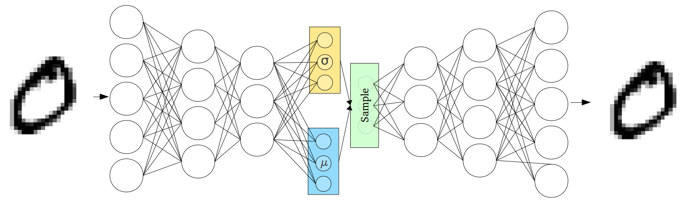

### AE（Autoencoder）&VAE(Variational Autoencoder) 

===========================
#### 00-项目信息
```
作者：TuringEmmy
时间:2021-04-07 09:37:34
详情：mnist数据集和fasion数据集上进行自动编码
```
#### 01-环境依赖
```
ubuntu18.04
python3.7
tensorflow>=2.0
```
#### 02-部署步骤
##### 训练
```
sh scripts/train_auto_encoders.sh.sh
sh scripts/train_varitional_autoEncoders.sh

```


#### 03-目录结构描述
```
.
├── AutoEncoders.py
├── data.py
├── images
│   ├── autoencoder.png
│   └── variational_autoencoder.png
├── model.py
├── __pycache__
│   ├── data.cpython-37.pyc
│   └── model.cpython-37.pyc
├── readme.md
├── scripts
│   ├── train_auto_encoders.sh
│   └── train_varitional_autoEncoders.sh
└── VaritionalAutoEncoders.py

```
##### autoencoder

##### variational_autoencoder

#### 04-版本更新
##### V1.0.0 版本内容更新-2021-04-07 09:37:34
- 自动编码
##### v1.0.1  版本内容更新-2021-04-20 16:43:57
- 对原始代码重新组织目录结构

#### 05-应用
- 数据降维 可视化
- 数据去噪
- 图像压缩
- 特征学习

[AE（Autoencoder）详解 （pytorch实现）](https://blog.csdn.net/z_feng12489/article/details/88851163)